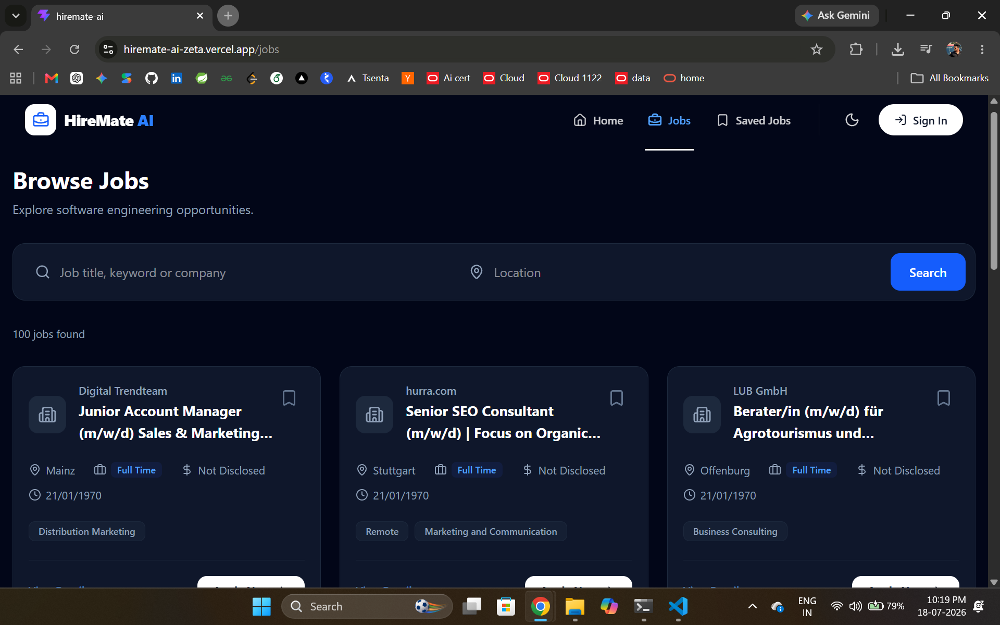
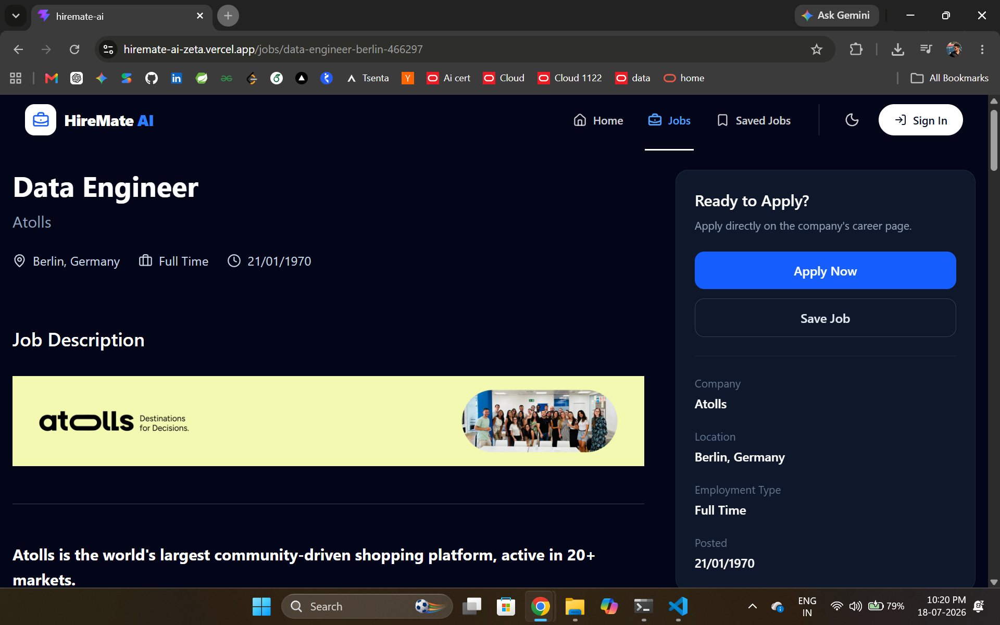
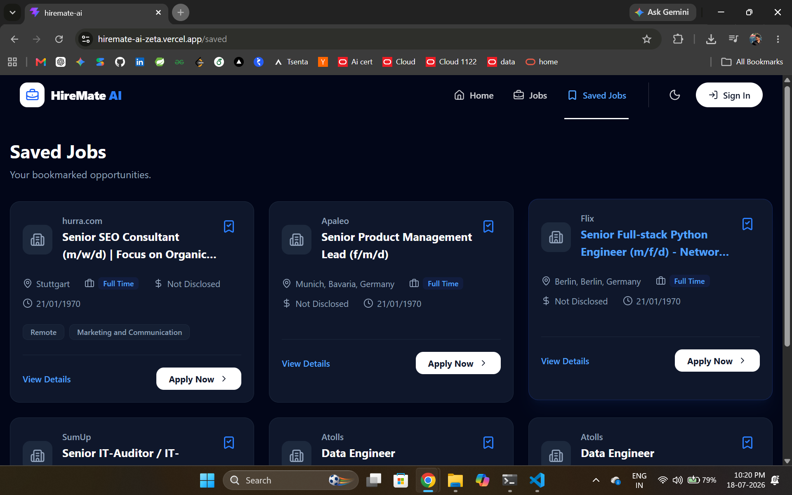

# HireMate AI

> AI-inspired job board built with **React**, **TypeScript**, **Tailwind CSS**, and **Vite**.

HireMate AI is a modern, responsive job board that helps software engineers discover opportunities through an intuitive interface. It features live job listings, advanced search, saved jobs, detailed job pages, and an automated CI pipeline.

---

## Live Demo

**Live Website:** https://hiremate-ai-zeta.vercel.app/

**Source Code:** https://github.com/ShubankarSai/hiremate-ai

---

## Screenshots

### Home Page


---

### Jobs Page



---

### 📄 Job Details



---

### Saved Jobs



---

# Features

### Smart Job Search

- Browse live software engineering jobs
- Search by title, keyword, or company
- Filter jobs by location
- Responsive search interface

### Job Listings

- Live jobs fetched from the Arbeitnow API
- Beautiful responsive job cards
- Employment type badges
- Tags and metadata
- Load More functionality

### Job Details

- Complete job description
- Company information
- Employment details
- Apply directly on the company website
- Save/Unsave jobs

### Saved Jobs

- Bookmark jobs
- Local Storage persistence
- Dedicated Saved Jobs page
- Instant toast notifications

### User Experience

- Dark Mode
- Responsive Design
- Smooth animations with Framer Motion
- Loading skeletons
- Empty states
- Modern UI

---

# Tech Stack

| Category | Technologies |
|-----------|--------------|
| Frontend | React 19, Vite, TypeScript |
| Styling | Tailwind CSS |
| Routing | React Router |
| Animations | Framer Motion |
| Icons | Lucide React |
| Notifications | Sonner |
| HTTP Client | Axios |
| State Management | React Context API |
| API | Arbeitnow Job Board API |
| CI | GitHub Actions |
| Deployment | Vercel |

---

# Project Structure

```text
src/
├── assets/
├── components/
│   ├── home/
│   ├── jobs/
│   ├── layout/
│   └── ui/
├── context/
├── data/
├── pages/
├── services/
├── types/
└── constants/
```

---

# Getting Started

Clone the repository

```bash
git clone https://github.com/ShubankarSai/hiremate-ai
```

Move into the project

```bash
cd hiremate-ai
```

Install dependencies

```bash
npm install
```

Run the development server

```bash
npm run dev
```

Build for production

```bash
npm run build
```

---

# CI/CD

This project includes an automated GitHub Actions workflow.

Every push or pull request to the `main` branch automatically:

- Installs dependencies using `npm ci`
- Runs ESLint
- Builds the project

Successful pushes are automatically deployed to **Vercel**.

---

# Design Decisions

- React Context API is used for lightweight global state management.
- TypeScript provides strong type safety and improves maintainability.
- Tailwind CSS enables rapid development with consistent styling.
- React Router powers client-side navigation.
- Framer Motion enhances the user experience with subtle animations.
- GitHub Actions ensures every commit passes linting and production builds before deployment.

---

# Future Enhancements

- AI-powered job recommendations
- User authentication
- Company logos
- Advanced filtering
- Salary range filters
- Pagination
- Recently viewed jobs
- Apply history
- Email notifications

---

# Author

**Shubankar Sai**

GitHub: https://github.com/ShubankarSai

LinkedIn: https://www.linkedin.com/in/shubankarsaik/
